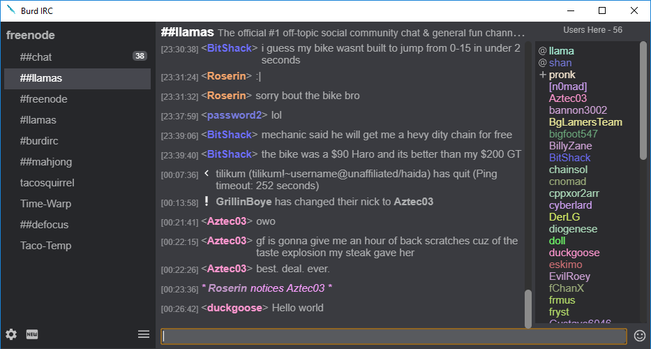

<h1 align="center">
 Burd IRC
 </h1>

 <b>
   <a href="https://burd.detectivetaco.net">Documentation</a>
   •
   <a href="https://burdirc.haxed.net">Homepage</a>
   •
  <a href="https://ci.appveyor.com/project/BurdIRC/burd/">AppVeyor</a>
 </b>

<h3 align="center">
 BurdIRC is a modern IRC client written in HTML and JavaScript and using electron.
</h3>

        
	 
      
 
               

         

	

<h3 align="center">
Latest Releases
</h3>

<b>Latest Stable:</b> 0.6.3

<b>Latest Development:</b> 0.6.3

 
 <h3 align="center">
 About
 </h3>
 
 
Burd IRC is an IRC client that is only compatible with macOS, Windows, and Debian based Linux. Burd is still missing certian things as it is fairly new IRC client in early development.

<h3 align="center">
  License
</h3>
 

 Burd IRC is licensed under the GNU General Public License v3. Burd IRC is free and open source software.

